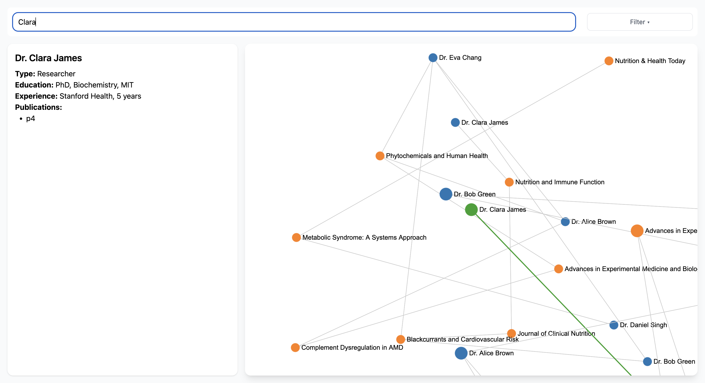

# 🏥 Interactive Healthcare Network Graph

This React-based interactive network visualisation tool allows users to explore relationships between healthcare professionals (HCPs). The app visualises an HCP at the centre and their direct or indirect connections via shared experiences, publications, or workplaces.

---

## 🚀 Features

- 🔍 **Search by HCP Name** – Locate and highlight a specific healthcare professional
- 🌐 **Graph Network Visualisation** – Display HCPs as nodes and their relationships as edges
- 🖱️ **Interactivity** – Click or hover on nodes/edges to view detailed information
- 📄 **Details Panel** – Education, experience, and publications displayed upon node selection
- 🧭 **Responsive & Accessible** – Built with TailwindCSS for responsive, modern UI

---

## 📦 Tech Stack

- **React + Vite** – Frontend framework and dev tooling
- **Sigma.js** – For interactive graph rendering
- **Graphology** – For flexible graph data structures
- **Tailwind CSS** – Utility-first styling
- **TypeScript** – Safer, structured development

---

## 🧪 Mock Data

The app loads from a mock data file:

---

## ⚙️ Development Setup

1. Clone the Repository

- git clone https://github.com/your-username/hcp-network-graph.git
- cd hcp-network-graph

2. Install Dependencies

- npm install

3. Run the Development Server

- npm run dev
- Open http://localhost:5173 to view it in the browser.

